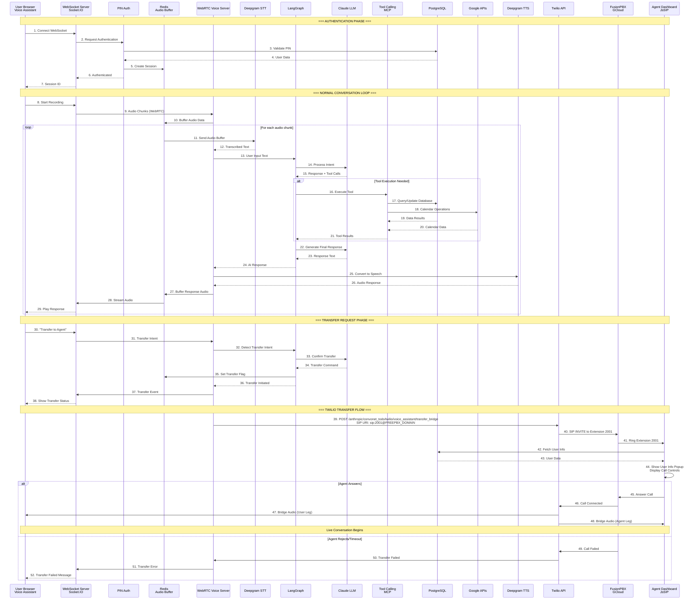

# WebRTC Call Flow Diagram - Convonet Voice Assistant

## Complete Flow Diagram

```mermaid
graph TB
    subgraph "User Browser"
        UA[User Browser<br/>Voice Assistant UI]
    end
    
    subgraph "Flask/WebSocket Server"
        WS[WebSocket Server<br/>Socket.IO]
        PIN[PIN Authentication<br/>Module]
        WVS[WebRTC Voice Server<br/>convonet/webrtc_voice_server.py]
    end
    
    subgraph "Session Management"
        REDIS[(Redis<br/>Audio Buffer & Session)]
    end
    
    subgraph "Speech Processing"
        DEEP[Deepgram STT<br/>Speech-to-Text]
        TTS[Deepgram TTS<br/>Text-to-Speech]
    end
    
    subgraph "AI Orchestration"
        LG[LangGraph<br/>Assistant Graph]
        LLM[Claude LLM<br/>Claude 3.5 Sonnet]
    end
    
    subgraph "Tools & External APIs"
        TOOLS[Tool Calling<br/>MCP Tools]
        PG[(PostgreSQL<br/>Database)]
        GOOGLE[Google APIs<br/>Calendar/OAuth]
        FUSION_LOOKUP[FusionPBX<br/>Metadata Lookup]
    end
    
    subgraph "Transfer System"
        TWILIO[Twilio API<br/>Programmable Voice]
        FUSIONPBX[FusionPBX<br/>Google Cloud<br/>Extension 2001]
    end
    
    subgraph "Agent Dashboard"
        AGENT[Call-Center<br/>Agent Dashboard<br/>JsSIP Client]
        POPUP[User Info Popup<br/>Call Controls]
    end
    
    subgraph "Monitoring"
        SENTRY[Sentry<br/>Error Monitoring]
        LOGS[Application Logs]
    end
    
    %% User Authentication Flow
    UA -->|1. Connect WebSocket| WS
    WS -->|2. Request PIN| PIN
    PIN -->|3. Validate| PG
    PG -->|4. Auth Result| PIN
    PIN -->|5. Session Created| REDIS
    PIN -->|6. Authenticated| WS
    WS -->|7. Session ID| UA
    
    %% Normal Conversation Loop
    UA -->|8. Start Recording| WS
    WS -->|9. Audio Chunks| WVS
    WVS -->|10. Buffer Audio| REDIS
    
    REDIS -->|11. Read Buffer| DEEP
    DEEP -->|12. Transcribed Text| WVS
    WVS -->|13. User Input| LG
    
    LG -->|14. Process Intent| LLM
    LLM -->|15. Response + Tool Calls| LG
    
    LG -->|16. Execute Tools| TOOLS
    TOOLS -->|17. Query/Update| PG
    TOOLS -->|18. Calendar Operations| GOOGLE
    TOOLS -->|19. PBX Metadata| FUSION_LOOKUP
    
    PG -->|20. Data| TOOLS
    GOOGLE -->|21. Calendar Data| TOOLS
    FUSION_LOOKUP -->|22. Extension Info| TOOLS
    
    TOOLS -->|23. Tool Results| LG
    LG -->|24. Final Response| LLM
    LLM -->|25. Response Text| LG
    LG -->|26. Response| WVS
    WVS -->|27. Text| TTS
    TTS -->|28. Audio Response| WVS
    WVS -->|29. Stream Audio| REDIS
    REDIS -->|30. Audio Buffer| WS
    WS -->|31. Play Response| UA
    
    %% Transfer Request Flow
    UA -->|32. 'Transfer to Agent'| WS
    WS -->|33. Transfer Intent| WVS
    WVS -->|34. Detect Transfer| LG
    LG -->|35. Transfer Decision| LLM
    LLM -->|36. Transfer Command| LG
    LG -->|37. Set Transfer Flag| REDIS
    LG -->|38. Transfer Initiated| WVS
    WVS -->|39. Transfer Event| WS
    WS -->|40. Show Transfer Status| UA
    
    %% Twilio Transfer Flow
    WVS -->|41. Call Twilio API| TWILIO
    TWILIO -->|42. SIP INVITE| FUSIONPBX
    FUSIONPBX -->|43. Ring Extension 2001| AGENT
    AGENT -->|44. Fetch User Info| PG
    PG -->|45. User Data| AGENT
    AGENT -->|46. Show Popup| POPUP
    AGENT -->|47. Answer Call| FUSIONPBX
    FUSIONPBX -->|48. Call Connected| TWILIO
    TWILIO -->|49. Bridge Audio| UA
    TWILIO -->|50. Bridge Audio| AGENT
    
    %% Monitoring (All Operations)
    WVS -.->|Monitor| SENTRY
    LG -.->|Monitor| SENTRY
    TWILIO -.->|Monitor| SENTRY
    FUSIONPBX -.->|Monitor| LOGS
    SENTRY -.->|Alerts| LOGS
    
    %% Styling
    classDef userClass fill:#e1f5ff,stroke:#01579b,stroke-width:2px
    classDef serverClass fill:#f3e5f5,stroke:#4a148c,stroke-width:2px
    classDef aiClass fill:#e8f5e9,stroke:#1b5e20,stroke-width:2px
    classDef toolClass fill:#fff3e0,stroke:#e65100,stroke-width:2px
    classDef transferClass fill:#fce4ec,stroke:#880e4f,stroke-width:2px
    classDef agentClass fill:#fff9c4,stroke:#f57f17,stroke-width:2px
    classDef monitorClass fill:#ffebee,stroke:#c62828,stroke-width:2px
    classDef storageClass fill:#e0f2f1,stroke:#004d40,stroke-width:2px
    
    class UA userClass
    class WS,PIN,WVS serverClass
    class LG,LLM,DEEP,TTS aiClass
    class TOOLS,PG,GOOGLE,FUSION_LOOKUP toolClass
    class TWILIO,FUSIONPBX transferClass
    class AGENT,POPUP agentClass
    class SENTRY,LOGS monitorClass
    class REDIS storageClass
```



## Detailed Sequence Diagram



## Component Interaction Matrix

| Component | Input From | Output To | Purpose |
|-----------|-----------|-----------|---------|
| **User Browser** | User voice input | WebSocket Server | Captures audio, displays UI |
| **WebSocket Server** | Browser, WebRTC Server | Browser, Redis | Manages real-time communication |
| **PIN Auth** | WebSocket Server | PostgreSQL | Validates user credentials |
| **Redis** | WebRTC Server, Tools | Deepgram, WebRTC Server | Buffers audio, stores session |
| **Deepgram STT** | Redis Audio Buffer | WebRTC Voice Server | Converts speech to text |
| **LangGraph** | WebRTC Server | Claude LLM, Tools | Orchestrates AI conversation flow |
| **Claude LLM** | LangGraph | LangGraph | Generates responses, decides actions |
| **Tool Calling** | LangGraph | PostgreSQL, Google APIs | Executes external operations |
| **Deepgram TTS** | LangGraph Response | WebRTC Server | Converts text to speech |
| **Twilio API** | WebRTC Server | FusionPBX | Bridges call to agent |
| **FusionPBX** | Twilio | Agent Dashboard | Routes call to extension |
| **Agent Dashboard** | FusionPBX | PostgreSQL, User | Displays call, shows user info |

## Key Flow Points

### 1. **Authentication (Steps 1-7)**
- User connects via WebSocket
- PIN validated against PostgreSQL
- Session created in Redis
- User receives session ID

### 2. **Normal Conversation Loop (Steps 8-31)**
- Audio captured → Redis buffer
- Deepgram transcribes → LangGraph processes
- Claude generates response → Tools execute if needed
- Deepgram TTS converts to audio → Streamed back to user

### 3. **Transfer Request (Steps 32-38)**
- User requests transfer
- LangGraph detects intent
- Transfer flag set in Redis
- User notified of transfer status

### 4. **Twilio Transfer (Steps 39-52)**
- WebRTC server calls Twilio API
- Twilio dials FusionPBX extension
- Agent dashboard receives call
- User info popup displayed
- Audio bridged between user and agent

## Environment Variables Required

```bash
# For WebRTC Voice Assistant
DEEPGRAM_API_KEY=dg_xxx
ANTHROPIC_API_KEY=sk-ant-xxx
REDIS_HOST=xxx
REDIS_PASSWORD=xxx

# For Transfer
TWILIO_ACCOUNT_SID=ACxxx
TWILIO_AUTH_TOKEN=xxx
FREEPBX_DOMAIN=136.115.41.45
TRANSFER_TIMEOUT=30

# For Database
DB_URI=postgresql://xxx
```

## Notes

1. **Redis Audio Buffer**: Stores audio chunks during conversation, not after LangGraph processing
2. **Deepgram STT**: Used for WebRTC transcription, not Twilio calls (Twilio has its own STT)
3. **Tool Calling**: Executes between LangGraph and LLM, not after final response
4. **Transfer Flow**: Twilio only involved during transfer, not in normal conversation
5. **Agent Dashboard**: Registers with FusionPBX via WSS, receives calls via SIP

---

**Last Updated**: 2024-11-16  
**Version**: 2.0 (Corrected Flow)

