# Convonet Voice Assistant - Complete Flow Diagram

## Complete System Flow: Authentication → Conversation → Transfer

```mermaid
sequenceDiagram
    participant User as 👤 User Browser
    participant WS as 🔌 WebSocket Server<br/>(Socket.IO)
    participant Auth as 🔐 PIN Auth
    participant PG as 🗄️ PostgreSQL
    participant Redis as 📦 Redis
    participant WVS as 🎤 WebRTC Voice Server
    participant Deepgram as 🎙️ Deepgram STT
    participant LG as 🤖 LangGraph Agent
    participant LLM as 🧠 Claude LLM
    participant Tools as 🛠️ Tools<br/>(DB/Calendar/PBX)
    participant TTS as 🔊 TTS Engine
    participant Twilio as ☁️ Twilio API
    participant FPBX as 📞 FusionPBX
    participant Agent as 👨‍💼 Agent Dashboard<br/>(JsSIP)

    Note over User,Agent: ==========================================<br/>PHASE 1: AUTHENTICATION (Steps 1-7)<br/>==========================================

    User->>WS: 1. Connect WebSocket
    WS->>Auth: 2. Request Authentication
    Auth->>PG: 3. Validate PIN
    PG-->>Auth: 4. User Data (ID, Name, Teams)
    Auth->>Redis: 5. Create Session
    Auth-->>WS: 6. Authenticated
    WS-->>User: 7. Session ID

    Note over User,Agent: ==========================================<br/>PHASE 2: NORMAL CONVERSATION LOOP (Steps 8-31)<br/>==========================================

    loop For Each User Utterance
        User->>WS: 8. Start Recording
        WS->>WVS: 9. Audio Chunks (WebRTC)
        WVS->>Redis: 10. Buffer Audio Data
        
        WVS->>Deepgram: 11. Send Audio Buffer
        Deepgram-->>WVS: 12. Transcribed Text
        
        WVS->>LG: 13. User Input Text
        LG->>LLM: 14. Process Intent
        LLM-->>LG: 15. Response + Tool Calls
        
        alt Tool Execution Needed
            LG->>Tools: 16. Execute Tool
            Tools->>PG: 17. Query/Update Database
            Tools->>Tools: 18. Calendar Operations
            PG-->>Tools: 19. Data Results
            Tools-->>Tools: 20. Calendar Data
            Tools-->>LG: 21. Tool Results
        end
        
        LG->>LLM: 22. Generate Final Response
        LLM-->>LG: 23. Response Text
        LG-->>WVS: 24. AI Response
        
        WVS->>TTS: 25. Convert to Speech
        TTS-->>WVS: 26. Audio Response
        WVS->>Redis: 27. Buffer Response Audio
        Redis->>WS: 28. Stream Audio
        WS-->>User: 29. Play Response
    end

    Note over User,Agent: ==========================================<br/>PHASE 3: TRANSFER REQUEST (Steps 30-38)<br/>==========================================

    User->>WS: 30. "Transfer to Agent"
    WS->>WVS: 31. Transfer Intent
    WVS->>LG: 32. Detect Transfer Intent
    LG->>LLM: 33. Confirm Transfer
    LLM-->>LG: 34. Transfer Command
    LG->>Redis: 35. Set Transfer Flag
    LG-->>WVS: 36. Transfer Initiated
    WVS->>WS: 37. Transfer Event
    WS-->>User: 38. Show Transfer Status

    Note over User,Agent: ==========================================<br/>PHASE 4: TWILIO TRANSFER FLOW (Steps 39-52)<br/>==========================================

    WVS->>Twilio: 39. POST /transfer_bridge<br/>SIP: sip:2001@FREEPBX_DOMAIN
    Twilio->>FPBX: 40. SIP INVITE to Extension 2001
    FPBX->>Agent: 41. Ring Extension 2001
    Agent->>PG: 42. Fetch User Info
    PG-->>Agent: 43. User Data
    Agent->>Agent: 44. Show User Info Popup<br/>Display Call Controls
    
    alt Agent Answers
        Agent->>FPBX: 45. Answer Call
        FPBX->>Twilio: 46. Call Connected
        Twilio->>User: 47. Bridge Audio (User Leg)
        Twilio->>Agent: 48. Bridge Audio (Agent Leg)
        Note over User,Agent: 🎉 Live Conversation Begins
    else Agent Rejects/Timeout
        FPBX->>Twilio: 49. Call Failed
        Twilio-->>WVS: 50. Transfer Failed
    end
```

## Key Components

### Phase 1: Authentication
- **WebSocket Connection**: Socket.IO establishes real-time connection
- **PIN Authentication**: PostgreSQL validates user credentials
- **Session Management**: Redis stores session state

### Phase 2: Conversation Loop
- **Audio Capture**: Browser → WebRTC → Redis buffer
- **Speech-to-Text**: Deepgram STT (not Twilio)
- **AI Processing**: LangGraph + Claude LLM
- **Tool Execution**: Database, Calendar, PBX operations
- **Text-to-Speech**: Deepgram TTS → Audio response

### Phase 3: Transfer Request
- **Intent Detection**: LangGraph detects transfer request
- **Transfer Flag**: Redis tracks transfer state
- **User Notification**: WebSocket notifies browser

### Phase 4: Twilio Transfer
- **Twilio API**: Creates SIP call to FusionPBX
- **FusionPBX Routing**: Routes to extension 2001
- **Agent Dashboard**: JsSIP client receives call
- **Call Bridging**: Twilio bridges user and agent audio

## Technology Stack

| Component | Technology |
|-----------|-----------|
| WebSocket | Socket.IO (Flask) |
| Database | PostgreSQL (SQLAlchemy) |
| Cache | Redis |
| STT | Deepgram |
| LLM | Claude (via LangGraph) |
| TTS | Deepgram |
| Telephony | Twilio + FusionPBX |
| Agent Client | JsSIP (WebRTC) |

